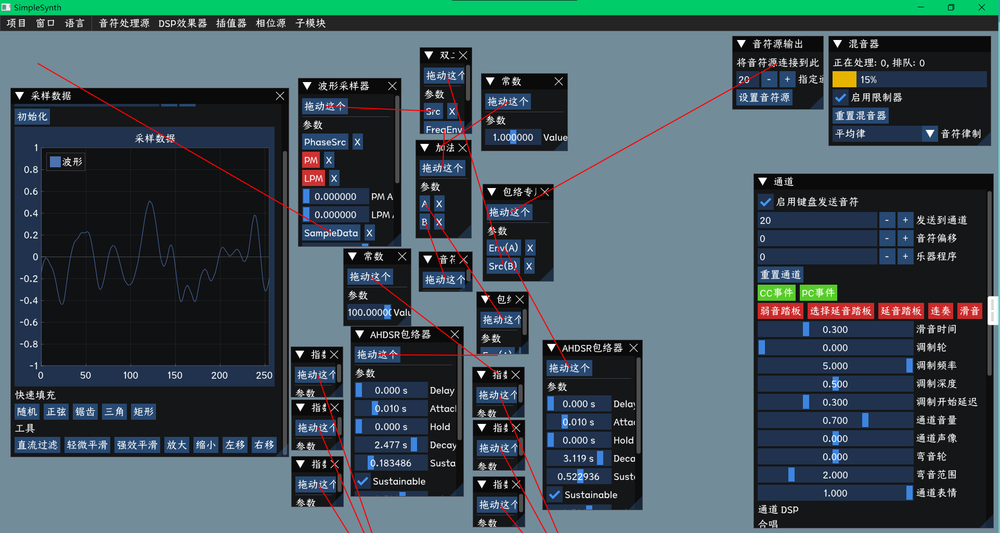

# SimpleSynth - 轻量模块化跨平台音频合成器

`SimpleSynth` 是一款为开发者设计的轻量级、高度模块化跨平台C++音频合成引擎。它将复杂的音频合成逻辑封装为简洁直观的API，让你无需深入底层细节，即可快速在应用中集成专业级音频合成能力，兼顾易用性与扩展性。



## ✨ 核心特性

| 特性分类       | 具体能力                                                                 |
|----------------|--------------------------------------------------------------------------|
| 高性能合成     | 支持多线程（线程池）/单线程模式，高效处理多音符并发，适配不同性能需求场景 |
| 标准协议兼容   | 完整支持MIDI通道事件，可直接解析/响应标准MIDI消息，兼容MIDI 1.0规范      |
| 灵活音源系统   | 支持加载SF2（SoundFont2）、DLS格式音色库，内置SimpleMidiInstrument、TR808鼓组等基础音源 |
| 精细事件控制   | 提供**队列事件**（定时触发，适合预编排音乐）与**即时事件**（实时响应，适合外部输入）双模式 |
| 多格式文件支持 | 可解析MIDI（含RMID/MIDS变种）、XM（Fasttracker 2）文件，生成音频序列     |
| 跨平台适配     | 支持Windows（SDL/WinMM）、Android（Oboe）等系统的音频/MIDI驱动对接      |


## 🚀 典型应用场景

- **实时音频交互**：为虚拟乐器（如电子钢琴）、音乐游戏、互动音效系统提供低延迟声音响应
- **离线音频渲染**：将MIDI/XM文件高质量合成为WAV音频（支持单文件混合导出或多轨道分轨导出）
- **自定义音色开发**：通过继承`InstrumentProvider`类，实现专属合成音色（如模拟合成器、特殊音效）
- **音乐编程教育**：作为音频合成原理、MIDI协议的教学实践工具，API设计清晰易理解


## 🔍 核心概念

在使用前，建议先了解以下核心组件，帮助快速理解框架逻辑：

| 组件名称          | 核心作用                                                                 |
|-------------------|--------------------------------------------------------------------------|
| `Mixer2`          | 合成器核心引擎：管理事件队列、音源加载、音频缓冲区计算，是功能调度的核心  |
| `InstrumentProvider` | 音源提供者：负责加载/管理音色资源，为`Mixer2`提供音符对应的音频采样数据  |
| `ChannelEvent`    | 音频事件载体：包含`NoteOn`（音符开启）、`NoteOff`（音符关闭）、`ProgramChange`（音色切换）等MIDI标准事件 |
| `MixerSequence`   | 事件序列容器：从MIDI/XM文件解析生成，存储按时间排序的事件集合，支持批量发送到`Mixer2` |


## 🛠️ 快速开始

以下是一个完整的"初始化→加载音源→发送事件→合成音频"示例，帮助你快速跑通基础流程：

```cpp
#include "Mixer2.h"
#include "SimpleMidiInstrument.h"
#include "ChannelEvent.h"
using namespace yzrilyzr_simplesynth;

int main() {
    // 1. 初始化Mixer（缓冲区大小256，决定每次合成的样本数）
    auto mixer = std::make_shared<Mixer2>(256);

    // 2. 配置合成参数（多线程模式+48kHz采样率）
    mixer->setSynthMode(IMixer::MODE_THREAD_POOL, -1); // -1=自动匹配CPU核心数
    mixer->setSampleRate(48000); // 常见采样率：44100Hz（CD音质）、48000Hz（专业场景）

    // 3. 加载内置音源（SimpleMidiInstrument，适合快速测试）
    auto instr = std::make_shared<SimpleMidiInstrument>();
    mixer->setInstrumentProvider(instr);

    // 4. 发送队列事件（1秒后播放中央C音符，2秒后关闭）
    u_time currentTime = mixer->getCurrentTime();
    mixer->postEvent(new NoteOn(0, 60, 100), currentTime + 1.0); // 通道0 | 音符60（中央C） | 力度100
    mixer->postEvent(new NoteOff(0, 60, 100), currentTime + 2.0);

    // 5. 执行合成（实际项目中需在音频回调循环调用）
    mixer->mix();

    // 6. 获取合成结果（左/右声道音频数据，可对接音频驱动播放）
    u_sample* leftCh = mixer->getOutput(0);
    u_sample* rightCh = mixer->getOutput(1);

    return 0;
}
```


## 📀 音源加载详解

音源是音频合成的"音色库"，`SimpleSynth`支持多种加载方式，满足不同场景需求：

### 1. 加载SF2格式音色库（推荐）
SF2是广泛使用的开源音色库格式，可从网络获取丰富音色（如钢琴、弦乐、鼓组）：
```cpp
#include "instrument/SF2FormatInstrument.h"
#include "io/FileInputStream.h"
using namespace yzrilyzr_io;

// 加载本地SF2文件（需替换为实际文件路径）
auto sf2Instr = std::make_shared<SF2FormatInstrument>(
    FileInputStream("path/to/your/soundfont.sf2")
);
mixer->setInstrumentProvider(sf2Instr);
```

### 2. 加载DLS格式音色库
DLS是微软推出的音色格式，常见于Windows系统自带音色库：
```cpp
#include "instrument/DLSFormatInstrument.h"

auto dlsInstr = std::make_shared<DLSFormatInstrument>(
    FileInputStream("path/to/your/sound.dls")
);
mixer->setInstrumentProvider(dlsInstr);
```

### 3. 使用内置特殊音源
库内置TR808鼓组（经典电子鼓音色），需通过`ReplaceableInstrument`切换：
```cpp
#include "instrument/TR808DrumSet.h"
#include "instrument/ReplaceableInstrument.h"

// 基础音源+TR808鼓组组合
auto baseInstr = std::make_shared<SimpleMidiInstrument>();
auto replaceInstr = std::make_shared<ReplaceableInstrument>(baseInstr);
replaceInstr->setDrumSet(std::make_shared<TR808DrumSet>()); // 替换鼓组
mixer->setInstrumentProvider(replaceInstr);
```

### 4. 自定义音源（进阶）
若内置/标准格式无法满足需求，可继承`InstrumentProvider`实现自定义音色：
```cpp
class MyCustomInstr : public InstrumentProvider {
public:
    // 重写"获取乐器音色"方法（根据MIDI程序号返回对应音色处理器）
    NoteProcPtr get(s_bank_id bank, s_program_id program, u_sample_rate sr) override {
        // 自定义逻辑：例如根据program号返回不同合成算法（如正弦波、方波）
        return [=](const NoteEvent& e, SampleBuffer& buf) {
            // 实现具体的音频采样生成逻辑（如生成指定频率的正弦波）
        };
    }

    // 重写"获取鼓组音色"方法（MIDI通道10为鼓组通道）
    NoteProcPtr getDrumSet(s_bank_id bank, u_sample_rate sr) override {
        // 自定义鼓组音色逻辑
        return nullptr;
    }
};

// 使用自定义音源
auto myInstr = std::make_shared<MyCustomInstr>();
mixer->setInstrumentProvider(myInstr);
```


## 🎹 事件处理指南

`SimpleSynth`通过事件驱动音频合成，支持两种事件类型，覆盖不同使用场景：

### 1. 队列事件（Scheduled Events）
**适用场景**：预编排的音乐（如播放MIDI文件、自动伴奏），按指定时间触发。
```cpp
// 示例1：延迟3秒播放A4音符（69），力度80，持续2秒
u_time delay = 3.0;
mixer->postEvent(new NoteOn(0, 69, 80), mixer->getCurrentTime() + delay);
mixer->postEvent(new NoteOff(0, 69, 80), mixer->getCurrentTime() + delay + 2.0);

// 示例2：从MIDI文件加载事件序列
#include "MixerSequence.h"
#include "SynthUtil.h"

// 解析MIDI文件（支持.mid/.rmid/.mids格式）
std::shared_ptr<MixerSequence> midiSeq = SynthUtil::parseMIDI(
    FileInputStream("path/to/your/music.mid")
);
if (midiSeq) {
    // 1秒后开始播放，事件组命名为"MyMIDI"（便于后续管理）
    midiSeq->postToMixer(mixer.get(), 1.0, "MyMIDI");
}

// 示例3：从XM文件加载事件序列（Fasttracker 2模块文件）
std::shared_ptr<MixerSequence> xmSeq = SynthUtil::parseXM(
    FileInputStream("path/to/your/tune.xm")
);
if (xmSeq) {
    xmSeq->postToMixer(mixer.get(), 0.0, "MyXM"); // 立即播放
}
```

### 2. 即时事件（Instant Events）
**适用场景**：实时交互（如MIDI键盘输入、UI按钮触发），调用后立即生效。
```cpp
// 示例1：直接发送NoteOn事件（立即播放C5音符）
mixer->sendInstantEvent(new NoteOn(0, 72, 90));

// 示例2：通过MIDI字节快速发送（更符合硬件MIDI交互习惯）
#include "SynthUtil.h"

// 发送控制改变事件（CC 10：声像，值50 → 偏左声道）
SynthUtil::sendMIDIBytes(mixer.get(), 0xB0, 10, 50, "InstantInput");
// 发送程序改变事件（通道0，切换到钢琴音色（程序号0））
SynthUtil::sendMIDIBytes(mixer.get(), 0xC0, 0, 0, "InstantInput");
```


## 🔌 音频驱动对接

合成后的音频数据需通过系统音频驱动播放，以下是主流平台的对接示例：

### 1. Windows - SDL对接
SDL是跨平台多媒体库，适合快速实现Windows/macOS/Linux的音频播放：
```cpp
#include "SDL.h"
#include "Mixer2.h"
using namespace yzrilyzr_simplesynth;

Mixer2* g_mixer; // 全局Mixer实例（供回调函数访问）

// SDL音频回调函数（系统自动调用，填充音频缓冲区）
void sdl_audio_callback(void* userdata, Uint8* stream, int len) {
    // 1. 执行音频合成
    g_mixer->mix();

    // 2. 复制合成结果到SDL缓冲区（格式：AUDIO_S32SYS → 32位有符号整数）
    int numSamples = g_mixer->getBufferSize();
    u_sample* left = g_mixer->getOutput(0);
    u_sample* right = g_mixer->getOutput(1);
    int32_t* outBuf = reinterpret_cast<int32_t*>(stream);

    for (int i = 0; i < numSamples; ++i) {
        // 音频数据归一化（u_sample→int32_t，避免溢出）
        outBuf[i * 2] = static_cast<int32_t>(left[i] * 0x7fffffff);  // 左声道
        outBuf[i * 2 + 1] = static_cast<int32_t>(right[i] * 0x7fffffff); // 右声道
    }
}

int main() {
    // 初始化Mixer
    g_mixer = new Mixer2(256);
    g_mixer->setSynthMode(IMixer::MODE_THREAD_POOL, -1);
    g_mixer->setSampleRate(48000);
    g_mixer->setInstrumentProvider(std::make_shared<SimpleMidiInstrument>());

    // 初始化SDL音频
    SDL_Init(SDL_INIT_AUDIO);
    SDL_AudioSpec spec{};
    spec.freq = g_mixer->getSampleRate();
    spec.format = AUDIO_S32SYS;
    spec.channels = 2; // 立体声
    spec.samples = g_mixer->getBufferSize();
    spec.callback = sdl_audio_callback;

    if (SDL_OpenAudio(&spec, nullptr) != 0) {
        fprintf(stderr, "SDL音频初始化失败：%s\n", SDL_GetError());
        return -1;
    }

    // 开始播放（发送一个测试事件）
    SDL_PauseAudio(0);
    g_mixer->sendInstantEvent(new NoteOn(0, 60, 100));

    // 等待5秒后退出
    std::this_thread::sleep_for(std::chrono::seconds(5));

    // 资源释放
    SDL_CloseAudio();
    SDL_Quit();
    delete g_mixer;
    return 0;
}
```

### 2. Android - Oboe对接
Oboe是Google推荐的Android低延迟音频API，适合移动端应用：
```cpp
#include <oboe/Oboe.h>
#include "Mixer2.h"
using namespace yzrilyzr_simplesynth;
using namespace oboe;

// 全局变量（根据实际项目调整为成员变量）
Mixer2* g_mixer;
std::shared_ptr<AudioStream> g_audioStream;
std::optional<std::future<void>> g_mixFuture;

// Oboe音频回调（处理音频合成与缓冲区填充）
class OboeAudioCallback : public AudioStreamCallback {
public:
    DataCallbackResult onAudioReady(AudioStream* stream, void* audioData, int32_t numFrames) override {
        // 等待上一次合成完成（避免线程冲突）
        if (g_mixFuture.has_value()) {
            try { g_mixFuture->get(); } 
            catch (const std::exception& e) { LOGI("合成失败：%s", e.what()); }
            g_mixFuture.reset();
        }

        // 检查缓冲区大小匹配（避免音频错位）
        if (numFrames != g_mixer->getBufferSize()) {
            LOGI("缓冲区大小不匹配：期望%d，实际%d", g_mixer->getBufferSize(), numFrames);
            return DataCallbackResult::Continue;
        }

        // 异步执行合成（避免阻塞音频线程）
        g_mixFuture = std::async(std::launch::async, []() { g_mixer->mix(); });

        // 复制合成结果到Oboe缓冲区（格式：Float → 适配高版本Android）
        float* outBuf = static_cast<float*>(audioData);
        u_sample* left = g_mixer->getOutput(0);
        u_sample* right = g_mixer->getOutput(1);

        for (int i = 0, j = 0; j < numFrames; ++j) {
            outBuf[i++] = left[j];  // 左声道
            outBuf[i++] = right[j]; // 右声道
        }

        return DataCallbackResult::Continue;
    }
};

// JNI方法：初始化Oboe与Mixer（供Android Java层调用）
extern "C" JNIEXPORT jint JNICALL
Java_com_yourpackage_AudioEngine_init(JNIEnv* env, jobject thiz, jint sdkVersion) {
    // 初始化Mixer
    g_mixer = new Mixer2(256);
    g_mixer->setSynthMode(IMixer::MODE_THREAD_POOL, 4); // 移动端建议限制线程数（避免耗电）
    g_mixer->setSampleRate(48000);
    g_mixer->setInstrumentProvider(std::make_shared<SimpleMidiInstrument>());

    // 配置Oboe音频流
    AudioStreamBuilder builder;
    auto callback = std::make_unique<OboeAudioCallback>();
    builder.setSharingMode(SharingMode::Exclusive)
           .setPerformanceMode(sdkVersion >= 26 ? PerformanceMode::LowLatency : PerformanceMode::PowerSaving)
           .setFormat(sdkVersion >= 23 ? AudioFormat::Float : AudioFormat::I16) // 低版本用16位整数
           .setChannelCount(ChannelCount::Stereo)
           .setSampleRate(g_mixer->getSampleRate())
           .setFramesPerDataCallback(g_mixer->getBufferSize())
           .setCallback(callback.release());

    // 打开音频流
    Result result = builder.openStream(g_audioStream);
    if (result != Result::OK || !g_audioStream) {
        LOGI("Oboe初始化失败：%s", convertToText(result));
        return -1;
    }

    // 开始播放
    g_audioStream->requestStart();
    return 0;
}

// JNI方法：发送MIDI事件（供Java层触发实时声音）
extern "C" JNIEXPORT void JNICALL
Java_com_yourpackage_AudioEngine_sendMidiEvent(JNIEnv* env, jobject thiz, jint status, jint data1, jint data2) {
    if (g_mixer) {
        SynMixer::MODE_SINGLE_THREAD, 0);
```

### 3. 设置采样率

采样率（Sample Rate）决定了音频的质量和处理速度。常见的采样率有 44100 Hz (CD音质) 和 48000 Hz。

```cpp
mixer->setSampleRate(48000);
```

### 4. 设置音源

音源是合成声音的基础。您可以加载外部音色库文件或使用内置的简单音色。

```cpp
// 示例：加载一个SF2音色库
auto sf2Instr = std::make_shared<yzrilyzr_simplesynth::SF2FormatInstrument>(
    yzrilyzr_io::FileInputStream("path/to/your/soundfont.sf2")
);
mixer->setInstrumentProvider(sf2Instr);
```

### 5. 向 Mixer 传入事件

有两种方式向Mixer发送事件：队列事件和即时事件。

### 6. 音频合成与输出

`mixer->mix()` 是整个流程的核心。它会根据当前时间和已有的事件，计算出下一个缓冲区的音频数据。

这个函数通常在音频API提供的回调函数中被调用。每次调用后，你都需要通过 `mixer->getOutput(channelIndex)` 来获取生成的音频数据，并将其复制到音频API提供的输出缓冲区中。

---

## 音源加载

### 加载 SF2 文件

SoundFont 2 (SF2) 是一种广泛使用的音色库格式。

```cpp
#include "instrument/SF2FormatInstrument.h"
#include "io/FileInputStream.h"

auto instr = std::make_shared<yzrilyzr_simplesynth::SF2FormatInstrument>(
    yzrilyzr_io::FileInputStream("path_to_sf2.sf2")
);
mixer->setInstrumentProvider(instr);
```

### 加载 DLS 文件

Downloadable Sounds (DLS) 是另一种常见的音色库格式，尤其在Windows系统中。

```cpp
#include "instrument/DLSFormatInstrument.h"

auto instr = std::make_shared<yzrilyzr_simplesynth::DLSFormatInstrument>(
    yzrilyzr_io::FileInputStream("path_to_dls.dls")
);
mixer->setInstrumentProvider(instr);
```

### 使用内置音源

库中提供了一些简单的内置音源，方便快速测试和使用。

```cpp
// 使用简单的MIDI乐器
auto instr = std::make_shared<yzrilyzr_simplesynth::SimpleMidiInstrument>();
mixer->setInstrumentProvider(instr);

// 使用808鼓组
#include "instrument/TR808DrumSet.h"
#include "instrument/ReplaceableInstrument.h"

auto simpleInstr = std::make_shared<yzrilyzr_simplesynth::SimpleMidiInstrument>();
auto replaceableInstr = std::make_shared<yzrilyzr_simplesynth::ReplaceableInstrument>(simpleInstr);
//替换默认鼓组（SimpleMidiInstrument内包含默认鼓组）
//replaceableInstr->setDrumSet(std::make_shared<yzrilyzr_simplesynth::TR808DrumSet>());
mixer->setInstrumentProvider(replaceableInstr);
```

### 自定义音源

如果内置和标准格式的音源无法满足需求，您可以通过继承 `InstrumentProvider` 类来创建自己的音源。

```cpp
class MyCustomInstrumentProvider : public yzrilyzr_simplesynth::InstrumentProvider {
    // 重写必要的方法...
    NoteProcPtr get(s_bank_id bank, s_program_id program, u_sample_rate sampleRate) override;
    NoteProcPtr getDrumSet(s_bank_id bank, u_sample_rate sampleRate) override;
};

auto myInstr = std::make_shared<MyCustomInstrumentProvider>();
mixer->setInstrumentProvider(myInstr);
```

---

## 事件处理

### 队列事件 (Scheduled Events)

队列事件会在指定的时间点被触发，非常适合播放预先编排好的音乐。

```cpp
// 在2秒后播放一个音符
u_time delay = 2.0;
mixer->postEvent(new yzrilyzr_simplesynth::NoteOn(0, 60, 100), mixer->getCurrentTime() + delay);
```

**从音乐文件加载事件序列:**

库支持从MIDI和XM（Fasttracker 2）文件中解析事件序列。

支持MIDI RIFF版本变种：RMID MIDS

```cpp
#include "MixerSequence.h"
#include "SynthUtil.h"

// 从MIDI文件加载
std::shared_ptr<yzrilyzr_simplesynth::MixerSequence> midiSeq = 
    yzrilyzr_simplesynth::SynthUtil::parseMIDI(yzrilyzr_io::FileInputStream("path_to_midi.mid"));
if (midiSeq) {
    // 将整个序列的事件以1秒的延迟发送到mixer
    midiSeq->postToMixer(mixer.get(), 1.0, "MyMIDI_Song");
}

// 从XM文件加载
std::shared_ptr<yzrilyzr_simplesynth::MixerSequence> xmSeq = 
    yzrilyzr_simplesynth::SynthUtil::parseXM(yzrilyzr_io::FileInputStream("path_to_xm.xm"));
if (xmSeq) {
    xmSeq->postToMixer(mixer.get(), 0.0, "MyXM_Tune");
}
```

### 即时事件 (Instant Events)

即时事件会立即被处理，适用于响应外部输入，如MIDI键盘或用户界面的按钮。

```cpp
// 立即播放一个音符
mixer->sendInstantEvent(new yzrilyzr_simplesynth::NoteOn(0, 64, 100));

// 更方便地发送MIDI字节
#include "SynthUtil.h"
// 发送一个控制改变事件 (CC 10, value 50)
yzrilyzr_simplesynth::SynthUtil::sendMIDIBytes(mixer.get(), 0xB0, 10, 50, "InstantInput");
```

---

## 音频播放与驱动对接

要听到声音，你需要将 `Mixer` 的输出连接到一个音频播放API。

### SDL 对接

SDL (Simple DirectMedia Layer) 是一个跨平台的多媒体库，非常适合用于此目的。

```cpp
#include "SDL.h"
#include "Mixer2.h"
yzrilyzr_simplesynth::Mixer2* mixer;
// SDL音频回调函数
void fill_audio_pcm(void *userdata, Uint8 *stream, int len) {
    // 1. 调用 mix() 生成音频数据
    mixer->mix();

    // 2. 将 mixer 的输出缓冲区数据复制到 SDL 的输出流中
    int numSamples = mixer->getBufferSize();
    int numChannels = mixer->getOutputChannelCount();
    u_sample* left = mixer->getOutput(0);
    u_sample* right = mixer->getOutput(1);

    // 假设 SDL 格式为 AUDIO_S32SYS (32位有符号整数)
    int32_t* out = reinterpret_cast<int32_t*>(stream);
    for (int i = 0; i < numSamples; ++i) {
        *out++ = static_cast<int32_t>(left[i] * 0x7fffffff);
        *out++ = static_cast<int32_t>(right[i] * 0x7fffffff);
    }
}

// 在主函数中初始化 SDL
int main() {
    //初始化Mixer
    mixer=new Mixer2(256);
    SDL_Init(SDL_INIT_AUDIO);

    SDL_AudioSpec spec;
    spec.freq = mixer->getSampleRate();
    spec.format = AUDIO_S32SYS;
    spec.channels = 2;
    spec.samples = mixer->getBufferSize();
    spec.callback = fill_audio_pcm;
    spec.userdata = mixer.get();

    if (SDL_OpenAudio(&spec, nullptr) != 0) {
        // 错误处理
    }
    
    SDL_PauseAudio(0); // 开始播放
    
    // ... 在这里向 mixer 发送事件 ...
    
    // 等待用户输入或事件处理完成
    std::this_thread::sleep_for(std::chrono::seconds(10));
    
    SDL_CloseAudio();
    SDL_Quit();
    return 0;
}
```

### Android Oboe 对接

Oboe 是 Google 推荐的 Android 原生音频API。

```cpp
#include <oboe/Oboe.h>

// 1. 定义一个回调类
class MyAudioCallback : public oboe::AudioStreamCallback {
public:
    oboe::DataCallbackResult onAudioReady(oboe::AudioStream *stream, void *audioData, int32_t numFrames) override {
        // 假设 Mixer2* mixer 是一个全局或成员变量
        if (numFrames != mixer->getBufferSize()) {
            // 处理缓冲区大小不匹配的情况
            return oboe::DataCallbackResult::Continue;
        }

        // 2. 调用 mix() 生成音频数据
        mixer->mix();

        // 3. 将 mixer 的输出复制到 Oboe 的缓冲区
        float *outputBuffer = static_cast<float *>(audioData);
        u_sample *ch0 = mixer->getOutput(0);
        u_sample *ch1 = mixer->getOutput(1);
        
        for (int i = 0, j = 0; j < numFrames;) {
            outputBuffer[i++] = ch0[j];
            outputBuffer[i++] = ch1[j++];
        }
        
        return oboe::DataCallbackResult::Continue;
    }
};

// 4. 在 JNI 函数中初始化 Oboe
extern "C" JNIEXPORT jint JNICALL
Java_com_example_MyActivity_initAudio(JNIEnv *env, jobject thiz) {
    oboe::AudioStreamBuilder builder;
    auto callback = std::make_unique<MyAudioCallback>();
    
    builder.setSharingMode(oboe::SharingMode::Exclusive)
           //低延迟或省电。低延迟模式可能会导致卡顿，省电模式延迟高
           .setPerformanceMode(oboe::PerformanceMode::LowLatency)
           //注意 TARGET_SDK，某些低版本不支持Float
           .setFormat(oboe::AudioFormat::Float)
           .setChannelCount(oboe::ChannelCount::Stereo)
           .setSampleRate(mixer->getSampleRate())
           .setFramesPerDataCallback(mixer->getBufferSize())
           .setCallback(callback.get()); // 设置回调

    oboe::Result result = builder.openStream(&stream);
    if (result == oboe::Result::OK && stream) {
        stream->requestStart();
        return 0; // 成功
    }
    return -1; // 失败
}
```

---

## MIDI API 对接

### Windows WinMM 对接

WinMM (Windows Multimedia) API 可以用来接收和发送MIDI消息。

```cpp
#include <windows.h>
#include <mmsystem.h>
#pragma comment(lib, "winmm.lib")

HMIDIIN hMidiIn;

// MIDI输入回调函数
void CALLBACK MidiInProc(HMIDIIN hMidiIn, UINT wMsg, DWORD_PTR dwInstance, DWORD_PTR dwParam1, DWORD_PTR dwParam2) {
    if (wMsg == MIM_DATA) {
        DWORD midiMessage = dwParam1;
        BYTE status = midiMessage & 0xFF;
        BYTE data1 = (midiMessage >> 8) & 0xFF;
        BYTE data2 = (midiMessage >> 16) & 0xFF;
        
        // 将接收到的MIDI消息立即发送给mixer
        yzrilyzr_simplesynth::SynthUtil::sendMIDIBytes(mixer.get(), status, data1, data2, "WinMM_MIDI");
    }
}

// 在主函数中打开MIDI输入设备
void openMidiInput() {
    UINT numDevices = midiInGetNumDevs();
    for (UINT i = 0; i < numDevices; ++i) {
        MIDIINCAPS mic;
        if (midiInGetDevCaps(i, &mic, sizeof(MIDIINCAPS)) == MMSYSERR_NOERROR) {
            // 可以根据设备名进行筛选
            if (midiInOpen(&hMidiIn, i, reinterpret_cast<DWORD_PTR>(MidiInProc), 0, CALLBACK_FUNCTION) == MMSYSERR_NOERROR) {
                midiInStart(hMidiIn);
                std::cout << "MIDI input device opened: " << mic.szPname << std::endl;
                return;
            }
        }
    }
    std::cerr << "Failed to open MIDI input device." << std::endl;
}
```

---

## 音频导出

库提供了将合成的音频导出为WAV文件的功能，支持导出为单个混合文件或分轨文件。

```cpp
#include "util/WAVWriter.h"

void exportToWav(const std::string& baseFileName, std::shared_ptr<yzrilyzr_simplesynth::MixerSequence> seq) {
    // 创建一个用于导出的临时mixer
    yzrilyzr_simplesynth::Mixer2 exportMixer(8192); // 使用更大的缓冲区提高导出速度
    exportMixer.setSampleRate(48000);
    exportMixer.setSynthMode(yzrilyzr_simplesynth::IMixer::MODE_THREAD_POOL, -1);
    exportMixer.setInstrumentProvider(mixer->getInstrumentProvider()); // 使用与实时播放相同的音源
    exportMixer.setUseLimiter(true); // 启用限制器防止削波

    // 将事件序列发送到导出mixer
    seq->postToMixer(&exportMixer, 0);

    // 创建WAV文件写入器
    yzrilyzr_simplesynth::WAVWriter writer(baseFileName + ".wav");
    writer.prepare(exportMixer.getSampleRate(), 32, yzrilyzr_simplesynth::WAVWriter::FORMAT_FLOAT, 2);

    // 循环合成并写入文件，直到所有事件处理完毕
    while (exportMixer.hasData()) {
        exportMixer.mix();
        for (uint32_t sample = 0; sample < exportMixer.getBufferSize(); ++sample) {
            writer.writeFloat((float)exportMixer.getOutput(0)[sample]); // 左声道
            writer.writeFloat((float)exportMixer.getOutput(1)[sample]); // 右声道
            writer.nextSample();
        }
    }
    
    writer.end(); // 完成文件写入
}
```

