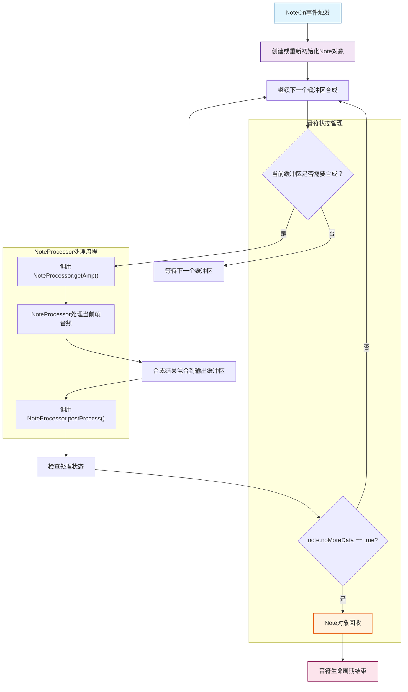

`Note` 类是合成器系统中表示单个MIDI音符的核心对象，负责存储音符的数据，从触发（NoteOn）到结束（NoteOff）。每个正在发音的音符都有一个独立的 `Note` 实例，包含合成所需的所有状态信息和参数。

## 音符对象数据

### 基础属性

| 字段 | 类型 | 范围 | 描述 |
|------|------|------|------|
| `uniqueID` | `uint8_t` | 0-255 | 音符唯一标识符，用于跟踪和调试 |
| `id` | `s_note_id_i` | 0-127 | MIDI音符编号（中央C4=60） |
| `velocity` | `s_note_vel` | 0.0-1.0 | 原始力度值（包含触后变化） |
| `velocitySynth` | `s_note_vel` | 0.0-1.0 | 实际合成力度（经过映射后的线性值） |

### 时间状态

| 字段 | 类型 | 单位 | 描述 |
|------|------|------|------|
| `startAtTime` | `u_time` | 秒 | NoteOn触发的时间戳 |
| `passedTime` | `u_time` | 秒 | NoteOn后经过的时间 |
| `closedAtTime` | `u_time` | 秒 | NoteOff触发的时间戳 |
| `closedPassedTime` | `u_time` | 秒 | NoteOff后经过的时间 |
| `forceCloseAtTime` | `u_time` | 秒 | 强制关闭的时间戳 |

### 合成参数

| 字段 | 类型 | 描述 |
|------|------|------|
| `phaseSynth` | `s_phase` | 当前合成相位（归一化0-1） |
| `freqSynth` | `u_freq` | 实际合成频率（Hz），仅用于计算周期 |
| `idSynth` | `s_note_id` | 实际合成音符ID（包含弯音效果） |
| `pitchBend` | `s_note_id` | 音符弯音值 |

### 滑音参数

| 字段 | 类型 | 描述 |
|------|------|------|
| `lastPortamentoID` | `s_note_id_i` | 上次滑音目标音符ID |
| `portamentoDeltaID` | `s_note_id` | 当前滑音差值（半音数） |

### 状态标志

| 字段 | 类型 | 描述 |
|------|------|------|
| `dataInvalidated` | `bool` | 数据是否失效（需要重新计算） |
| `noMoreData` | `bool` | 是否终止数据生成（生命周期结束） |

## 预定义音符常量

为了方便使用，Note类提供了常用音符的MIDI编号常量：

```cpp
// 使用示例
Note note(1);
note.id = Note::C4;      // 中央C (60)
note.id = Note::A4;      // 标准音高A4 (69) - 440Hz
note.id = Note::C5;      // 高八度C (72)

// 完整的八度范围
Note::C0;  // 12
Note::C1;  // 24
Note::C2;  // 36
Note::C3;  // 48
Note::C4;  // 60 (中央C)
Note::C5;  // 72
Note::C6;  // 84
Note::C7;  // 96
Note::C8;  // 108
Note::C9;  // 120
```

## 音符生命周期管理

### 生命周期流程图



### 状态检测方法

```cpp
// 检查音符是否已关闭
bool closed(const ChannelConfig& cfg) const;

// 检查音符是否被强制关闭
bool fclosed(const ChannelConfig& cfg) const;

// 使用示例
ChannelConfig& cfg = ...;  // 获取通道配置
Note note(1);

if (note.closed(cfg)) {
    // 音符已进入释放阶段
    std::cout << "Note is closing..." << std::endl;
}

if (note.fclosed(cfg)) {
    // 音符被强制关闭
    std::cout << "Note is force closed!" << std::endl;
}
```

### 关闭操作

```cpp
// 请求关闭音符（进入正常的Release阶段）
void requestClose(const ChannelConfig& cfg);

// 强制立即关闭音符（快速释放）
void forceClose(const ChannelConfig& cfg);

// 使用示例
void handleNoteOff(ChannelConfig& cfg, Note& note) {
    // 正常关闭
    note.requestClose(cfg);
    
    // 或强制关闭（适用于紧急停止）
    // note.forceClose(cfg);
}
```

## 音符操作API

### 构造函数

```cpp
// 创建新音符
Note note(uniqueID);  // uniqueID: 0-255的唯一标识符

// 示例：创建中央C音符
Note c4Note(1);
c4Note.id = Note::C4;
c4Note.velocity = 0.8f;  // 80%力度
c4Note.startAtTime = mixer->getCurrentTime();
```

### 复制状态

```cpp
// 从另一个音符复制状态
void set(const Note& other);

// 使用示例：滑音时保持部分状态
Note newNote(2);
newNote.set(oldNote);          // 复制旧音符状态
newNote.id = newPitch;         // 更新为新音高
newNote.startAtTime = currentTime;  // 更新开始时间
```

### 有效性检查

```cpp
// 静态方法：检查音符ID是否有效
static bool idInvalid(int id);

// 使用示例
if (Note::idInvalid(pitch)) {
    std::cerr << "Invalid note pitch: " << pitch << std::endl;
    return;
}
```

### 字符串表示

```cpp
// 获取音符描述字符串
yzrilyzr_lang::String toString() const;

// 使用示例
Note note(1);
note.id = 60;
note.velocity = 0.75f;

std::cout << note.toString() << std::endl;
// 输出: "[Note:60 Vel:0.75]"
```

