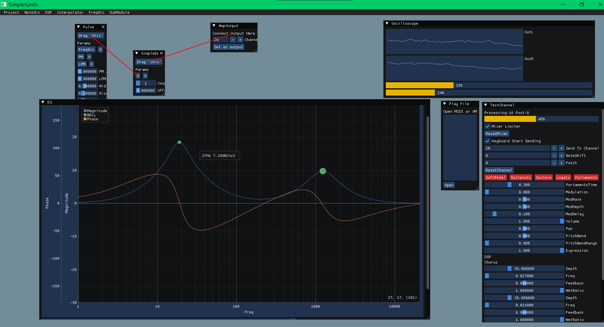

`SimpleSynth` 是一款为开发者设计的轻量级、高度模块化跨平台C++音频合成引擎。它将复杂的音频合成逻辑封装为简洁直观的API，让你无需深入底层细节，即可快速在应用中集成专业级音频合成能力，兼顾易用性与扩展性。

哪里简单了？每个合成模块只负责自己的一件事；使用起来也简单，仅需几行代码。

## ✨ 核心特性

| 特性分类       | 具体能力                                                                 |
|----------------|--------------------------------------------------------------------------|
| 高性能合成     | 支持多线程（线程池）/单线程模式，高效处理多音符并发，适配不同性能需求场景 |
| 标准协议兼容   | 完整支持MIDI通道事件，可直接解析/响应标准MIDI消息，兼容MIDI 1.0规范      |
| 灵活音源系统   | 支持加载SF2（SoundFont2）、DLS格式音色库，内置SimpleMidiInstrument（纯计算合成，包含绝大多数GM音色）、TR808鼓组等基础音源开箱即用 |
| 精细事件控制   | 提供**队列事件**（定时触发，适合预编排音乐）与**即时事件**（实时响应，适合外部输入）双模式 |
| 多格式文件支持 | 可解析MIDI（含RMID/MIDS变种）、XM（Fasttracker 2）文件，生成音频序列     |
| 跨平台适配     | 支持Windows（SDL/WinMM）、Android（Oboe）等系统的音频/MIDI驱动对接      |

## 🎛️ 强大的合成引擎

SimpleSynth提供了丰富的合成模块，让你能够创建各种声音：

### 振荡器与波形生成
- **基础波形**：正弦波、方波、锯齿波、三角波
- **特殊波形**：SVPWM、VVVF、脉冲波、CymbalOsc
- **谐波合成**：AHarmonicWave、SineHarmonicWave系列
- **鼓类**：SimpleDrumAmp

### 包络控制
- AHDSR包络、多阶段包络
- 图形化包络（GraphEnvelop）
- 时间包络（TimeEnvelop）

### 滤波器
- Biquad滤波器组（支持动态控制）
- 均值滤波器（MeanFilterSrc）

### 物理建模合成
- **弦乐器**：BowedString、KarplusStrongSrc、Sitar、TwoStringResonator
- **钢琴**：PianoSrc、PianoSrc2
- **通用数字波导**：DWGNoteProcessor

### 声音处理
- **失真效果**：ArctanDistortion、SoftClip、TapeSaturation
- **调制效果**：HardSync、SoftSync、FreqModAmp
- **声音混合**：AmpAdder、AmpMultiplier、AmpRatioMixer
- **音高调整**：SimpleDetuner、NoteShift

### 噪声生成
- LFSR噪声、基础噪声源

## 🎵 调律系统

SimpleSynth提供多种音乐调律方式：

- **十二平均律**（EqualTemperament）- 默认
- **纯律**（JustIntonation）
- **毕达哥拉斯调律**（Pythagorean）
- **梅恩通调律**（Meantone）
- **Kirnberger**、**Vallotti**、**Werckmeister**、**Young**等历史调律

## 🚀 典型应用场景

- **实时音频交互**：为虚拟乐器（如电子钢琴）、音乐游戏、互动音效系统提供低延迟声音响应
- **离线音频渲染**：将MIDI/XM文件高质量合成为WAV音频（支持单文件混合导出或多轨道分轨导出）
- **自定义音色开发**：通过继承`NoteProcessor`类，实现专属合成音色（如模拟合成器、特殊音效）
- **音乐编程教育**：作为音频合成原理、MIDI协议的教学实践工具，API设计清晰易理解

## 🔍 核心概念

在使用前，建议先了解以下核心组件，帮助快速理解框架逻辑：

| 组件名称          | 核心作用                                                                 |
|-------------------|--------------------------------------------------------------------------|
| `Mixer2`          | 合成器核心引擎：管理事件队列、音源加载、音频缓冲区计算，是功能调度的核心  |
| `InstrumentProvider` | 音源提供者：负责加载/管理音色资源，为`Mixer2`提供音符处理器  |
| `NoteProcessor` | 音符生成核心：根据`Note`生成各种内容，如振荡波形、包络、运算器、滤波器，可以任意组合  |
| `ChannelEvent`    | 音频事件载体：包含`NoteOn`（音符开启）、`NoteOff`（音符关闭）、`ProgramChange`（音色切换）等MIDI标准事件 |
| `MixerSequence`   | 事件序列容器：从MIDI/XM文件解析生成，存储按时间排序的事件集合，支持批量发送到`Mixer2` |

